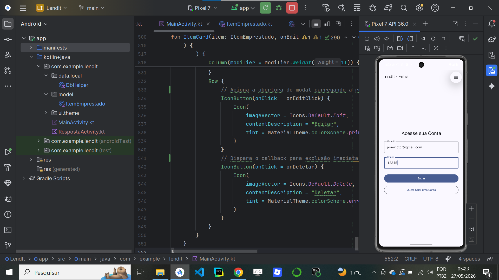
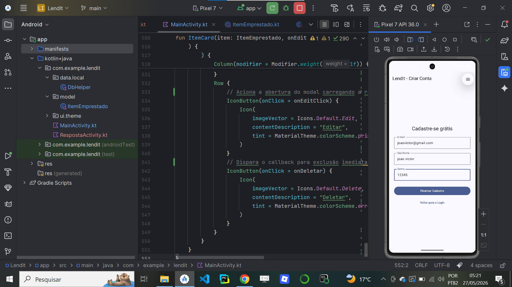
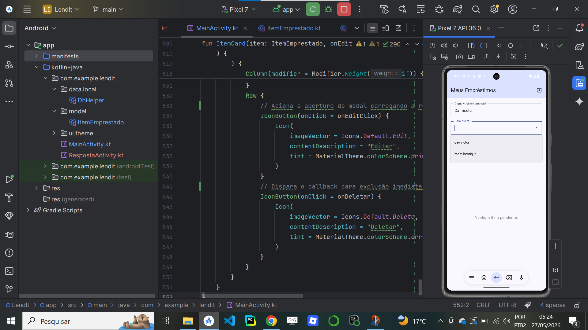
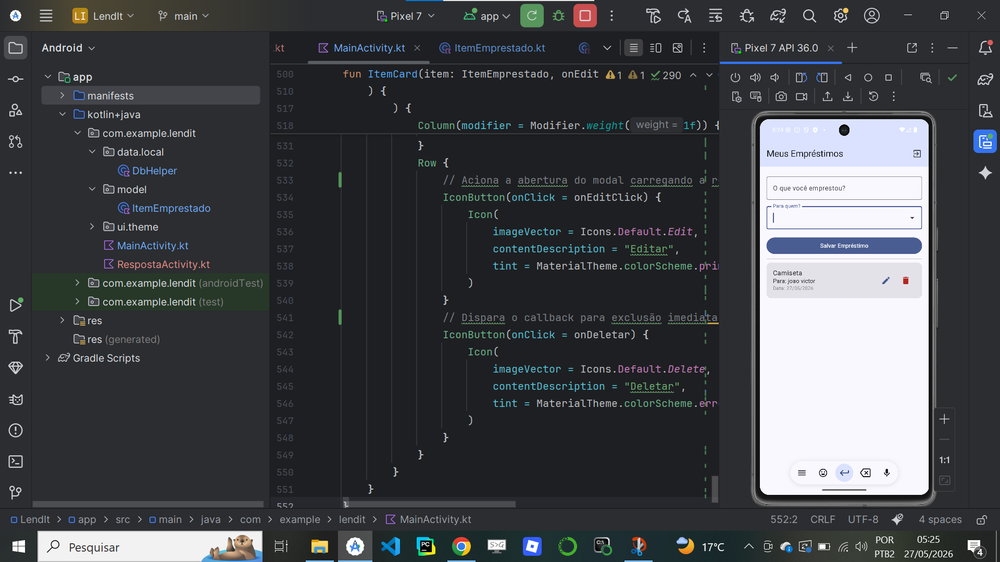

# LendIt

  

  

---

## Status Badge (Integração Contínua)

O selo (**badge**) no topo deste repositório indica o status em tempo real da nossa esteira de **CI (Continuous Integration)**, configurada via **GitHub Actions** (`ci.yml`). 

A cada modificação enviada ao repositório (*push* ou *pull request*), um servidor automatizado isolado (Ubuntu) é inicializado para validar o projeto. Ele executa os seguintes passos críticos:
1. **Setup do Ambiente:** Instalação e cache automatizado do Java SDK 17 (distribuição Zulu).
2. **Análise Estática (Lint):** Roda o comando `./gradlew lintDebug` para validar as boas práticas de código e garantir que não há erros de sintaxe ou recursos quebrados.
3. **Testes de Qualidade:** Roda o comando `./gradlew test` para checar a integridade lógica e garantir que nenhuma nova alteração quebrou funcionalidades antigas.

> 🟩 **Badge Verde (Passing):** Garante que o código está estável, seguro e compilando perfeitamente sem erros.

---

## Sobre o Projeto

O **LendIt** é um aplicativo nativo para Android desenvolvido em **Kotlin** utilizando a moderna e declarativa interface do **Jetpack Compose**. O objetivo principal do app é gerenciar o empréstimo de objetos pessoais para terceiros de forma simples e organizada, garantindo que o usuário nunca perca o controle de onde estão os seus pertences.

O grande diferencial desta arquitetura é o isolamento completo de dados por conta local, aliado à criptografia de senhas para proteção do usuário.

---

## Documentação e Arquitetura dos Arquivos

O core do projeto foi reestruturado seguindo as melhores práticas de desenvolvimento nativo e separação de responsabilidades. Abaixo está a explicação do que cada componente principal faz:

### 1. `ItemEmprestado.kt` (Model)
Localizado no pacote `com.example.lendit.model`, este arquivo é um `data class` que define formalmente o modelo de dados de um empréstimo. Ele é responsável por espelhar os campos que o banco de dados precisa armazenar, como o identificador único (`id`), a descrição do objeto (`nome`), o beneficiário (`paraQuem`), a data e o estado de conclusão do empréstimo. Ele possui também o campo `usuarioId`, essencial para mapear a qual conta aquele item pertence.

### 2. `DbHelper.kt` (Data/Local)
Localizado em `com.example.lendit.data.local`, é o coração de persistência do app. Herdando de `SQLiteOpenHelper`, ele gerencia a criação inicial e atualizações das tabelas locais do SQLite (`usuarios` e `itens_emprestados`). Ele isola de forma segura as operações de CRUD, garantindo que:
- As senhas sejam criptografadas antes de serem salvas, aplicando uma função hash **SHA-256**.
- O login compare as hashes criptografadas para validar o acesso.
- Cláusulas como `ON DELETE CASCADE` limpem os empréstimos caso um usuário seja excluído.
- Os métodos de busca retornem apenas os registros do usuário logado.

### 3. `MainActivity.kt` (View/Controller)
O ponto de entrada principal do aplicativo. Totalmente convertido para o **Jetpack Compose**, ele elimina a dependência de arquivos XML antigos e centraliza o fluxo do usuário dentro de estados reativos. É nesta classe que acontecem as validações visuais, a renderização dos formulários de Login, o Cadastro de novos perfis e a listagem dinâmica e em tempo real dos empréstimos ativos e finalizados do usuário.

### 4. `RespostaActivity.kt` (Activity de Suporte)
Originalmente criada no padrão tradicional de views em XML, este arquivo foi totalmente refatorado para o ambiente moderno do Jetpack Compose. Ela herda nativamente de `ComponentActivity` e usa o bloco de UI `setContent { }`. Sua reestruturação garante compatibilidade total com as dependências atuais do Gradle, eliminando erros antigos de vinculação de layout (`setContentView`) e referências inválidas, mantendo o ecossistema do app limpo e pronto para compilação.

---

## Demonstração do Fluxo (Interface Gráfica)

Abaixo estão os ecrãs que compõem o fluxo reativo do sistema, desenhados via Material Design 3 no Compose:

  
  
  
  
  

